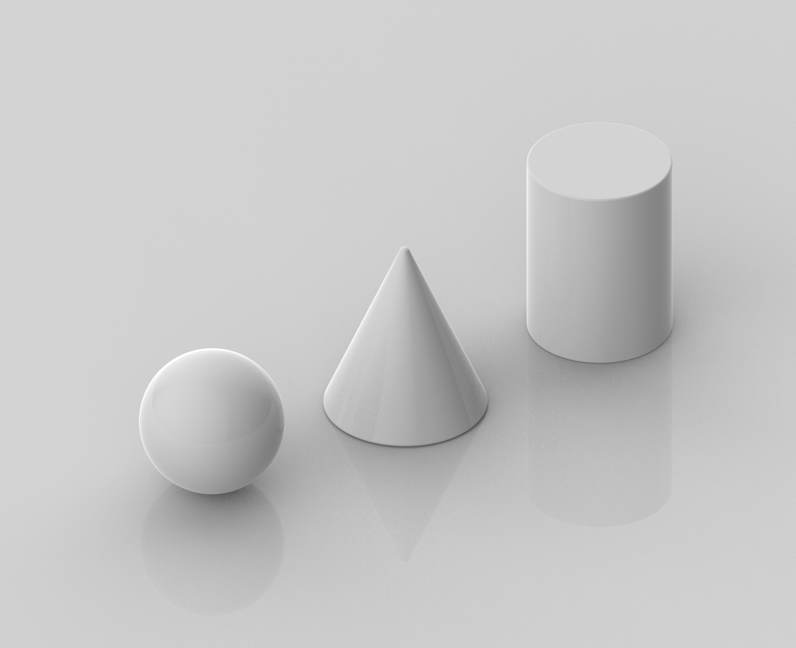
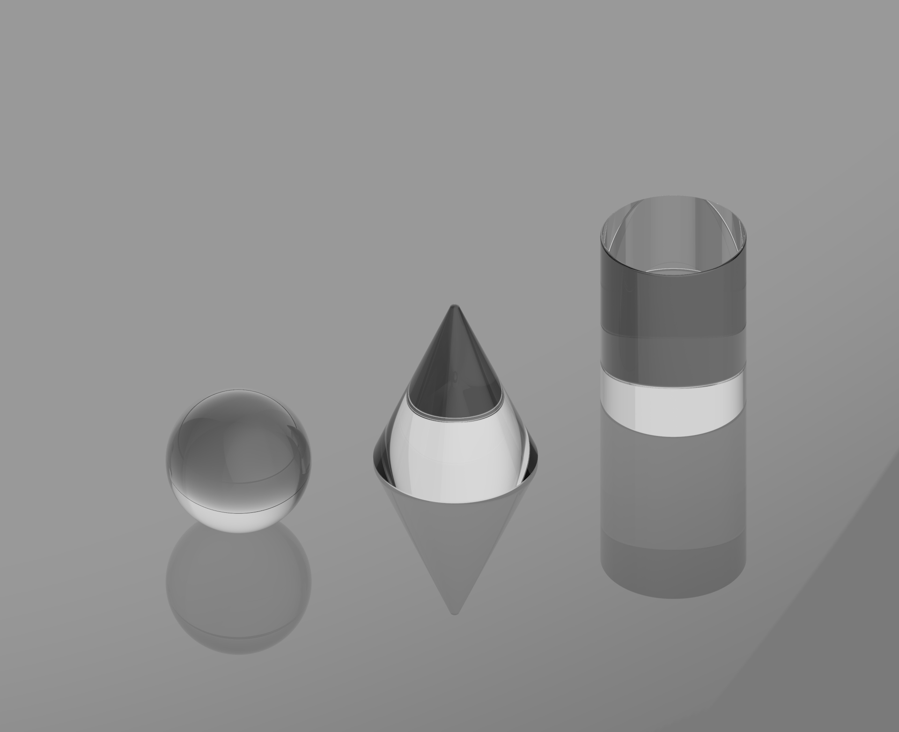
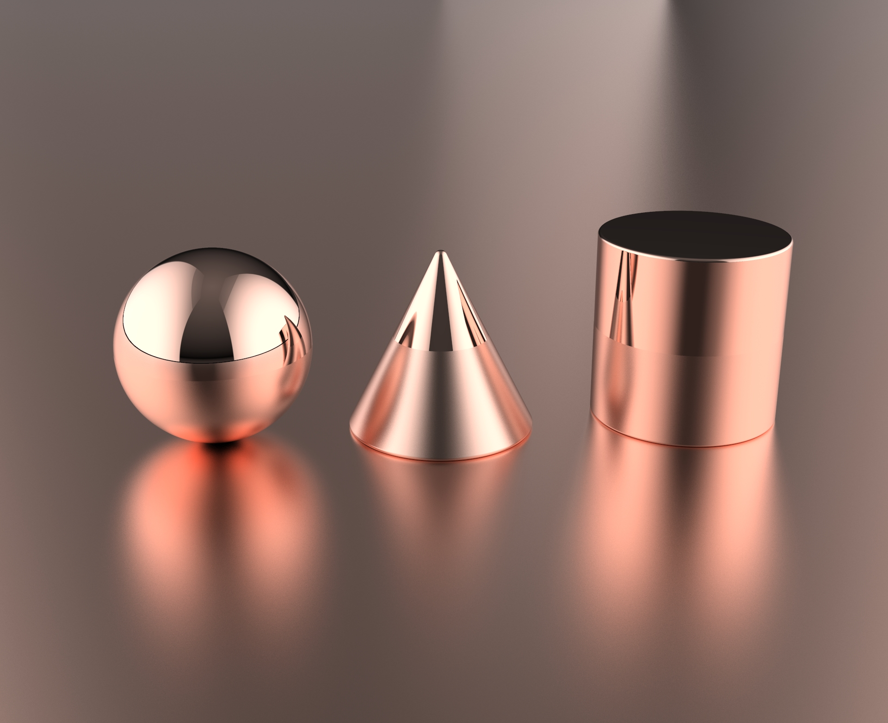
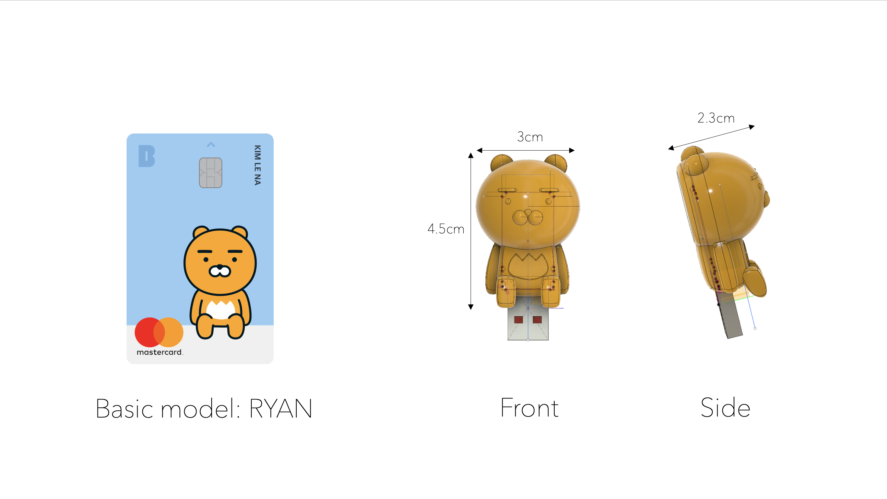
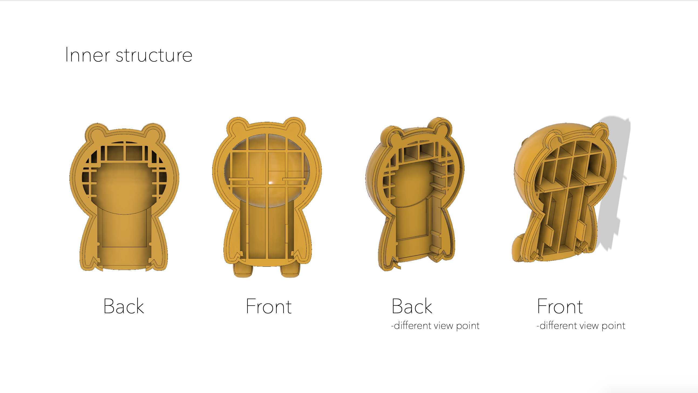
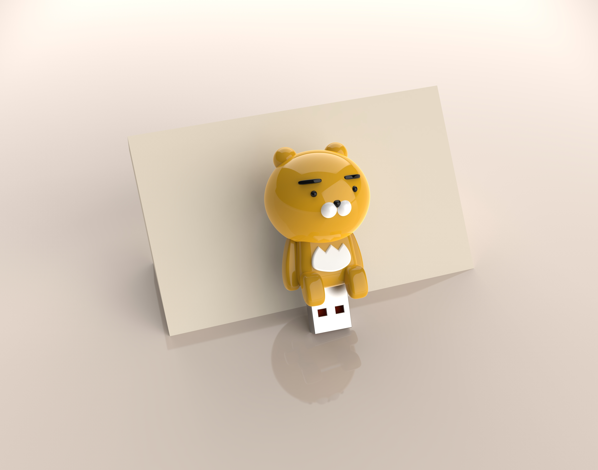
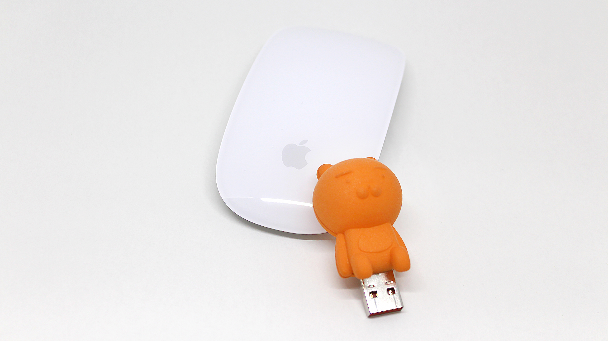
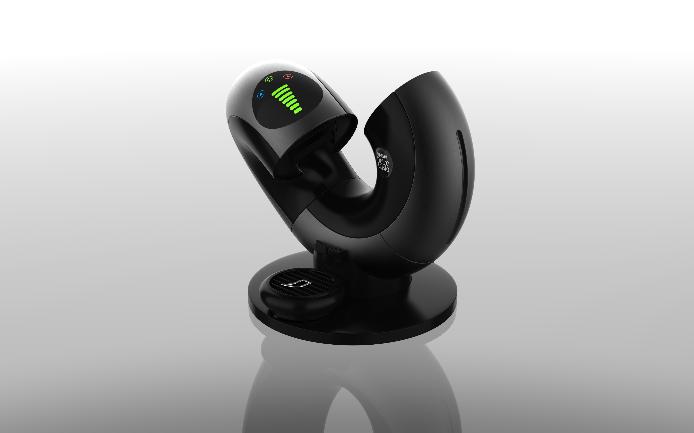
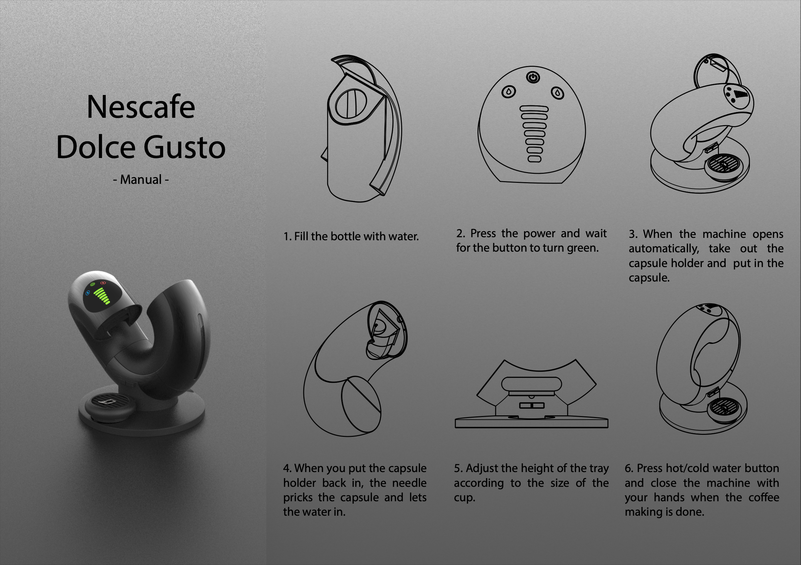
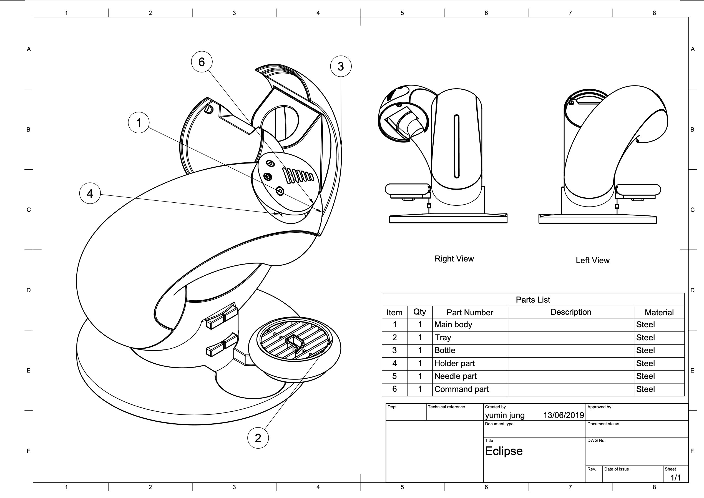

# ID219 Computer Aided Design

## Rendering Basics

### Neutral

### Transparent

### Copper

## USB Project

### Basic model

### Inner structure

### Rendering images

### Result photo
   

## 3D Model Rendering Project

### Studio

### Panel

### Tech

